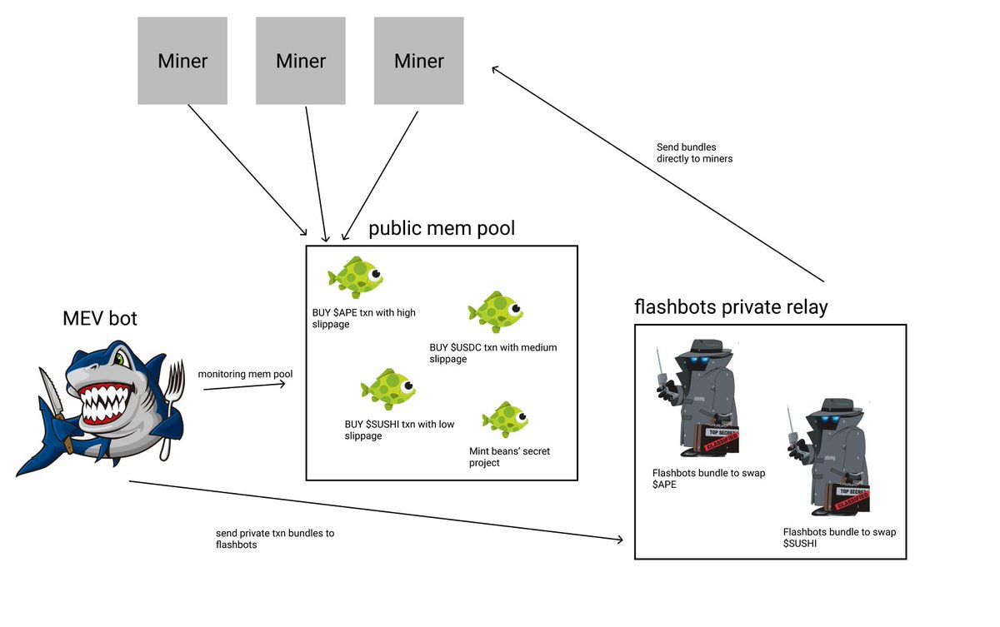

# 25_Flashbots

> 目前 Flashbots Bundle 仅支持 ethers.js v5 版本。

在以太坊转为 POS 之后，有超过 60% 的区块都是 flashbots 产出的，非常惊人，但是很多人并不了解它。这一讲，我们将介绍 Flashbots，包括:

1. 什么是 Flashbots?
2. 普通用户如何连接 Flashbots 节点发送隐私交易。
3. 开发者如何使用 Flashbots Bundle 打包多笔交易。

## Flashbots

Flashbots 是致力于减轻 MEV（最大可提取价值）对区块链造成危害的研究组织。目前有以下几款产品:

1. Flashbots RPC: 保护以太坊用户受到有害 MEV（三明治攻击）的侵害。
2. Flashbots Bundle: 帮助 MEV 搜索者（Searcher）在以太坊上提取 MEV。
3. mev-boost: 帮助以太坊 POS 节点通过 MEV 获取更多的 ETH 奖励。 

[最大可提取价值（MEV）](https://arxiv.org/abs/1904.05234) 是一种旨在研究共识安全性的衡量标准，矿工（或验证者、排序者或其他特权协议参与者）通过其任意包含、排除或重新排序交易的能力而获得的利润进行建模他们生产的区块。

### Flashbots RPC

Flashbots RPC 是一款面向以太坊普通用户的免费产品，你只需要在加密的钱包中将 RPC（网络节点）设置为Flashbots RPC，就可以将交易发送到Flashbots的私有交易缓存池（mempool）而非公开的，从而免受抢先交易/三明治攻击的损害。

下面我们演示一下如何用 Metamask 钱包连接 Flashbots RPC。

1. 点击 Metamask 顶部的网络按钮（默认显示 `Ethereum Mainnet`），然后点击底部的 `Add network` 按钮添加网络节点（新版 Metamask 还需要在下一个页面点击 `Add a network manually` 按钮）。
2. 依次输入网络参数:

```
Network name: Flashbots RPC
New RPC URL: https://rpc.flashbots.net
Chain ID: 1
Currency Symbol: ETH
Block Explorer URL: https://etherscan.io
```

完成这两步，你的加密钱包就成功的连接到了 Flashbots RPC，之后你只需要像往常一样操作钱包就可以避免三明治攻击了！
### Flashbots Bundle

在区块链上搜索 MEV 机会的开发者被称为`搜索者`。Flashbots Bundle（交易包）是一款帮助搜索者提取以太坊交易中 MEV 的工具。搜索者可以利用它将多笔交易组合在一起，按照指定的顺序执行。

举个例子，搜索者在公共`mempool`发现一笔在 `Uniswap` 买入PEOPLE代币的交易有被三明治攻击的机会，他可以在这币交易前后各插入一笔买入和卖出的交易，组成交易 Bundle 发送给 Flashbots。在些交易将在指定的区块执行，不会改变顺序，且不用担心被别的MEV机器人攻击。



### Flashbots Bundle脚本

Flashbots 提供了 [ethers-provider-flashbots-bundle](https://github.com/flashbots/ethers-provider-flashbots-bundle)，一个建立在 `ethers.js` 之上帮助搜索者连接 flashbots provider 并发送 flashbots bundle 的 JavaScript 库。你可以通过 `npm` 命令安装它。

```
npm install --save @flashbots/ethers-provider-bundle
```